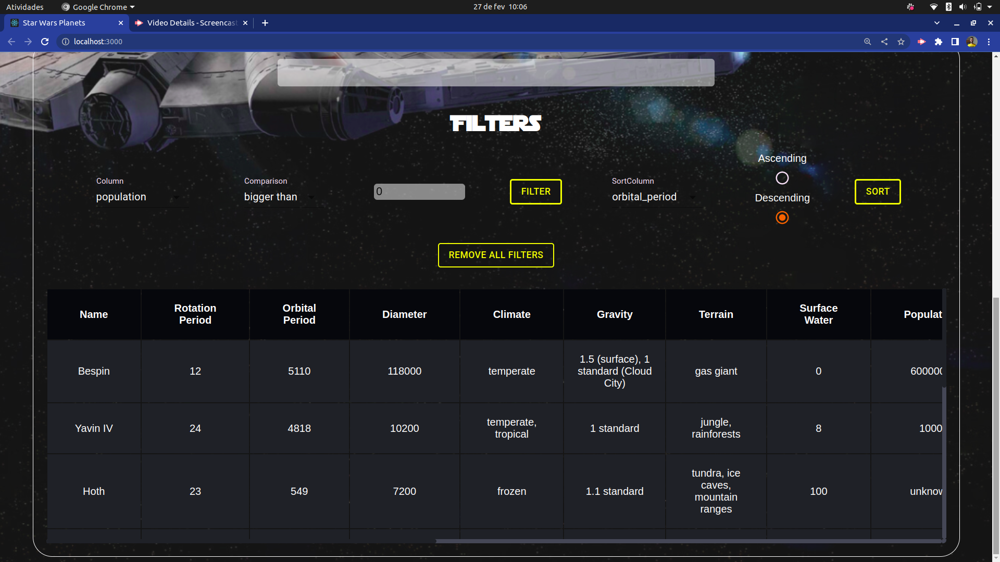

<!-- # :construction: README customizado em construção ! :construction: -->

<h1>Star Wars Planets Search</h1>

Research on planets in the star wars universe.

<h2>🚀 Objective</h2>

The idea was to make a query to an external API and work with the received data. Until then, I had distributed the data to the entire application using Redux, but this time I used Context API and hooks to make the request and have the data saved in the provider so that all components could have access.
 

The most challenging part was understanding the logic behind the hooks and dealing with the asynchrony that comes along with them when filtering the data. With many consultations to the documentation, practice, and mentorship, I was able to complete the project with 100% approval.

<h2>🛠️ Construído com</h2>

Mencione as ferramentas que você usou para criar seu projeto

<strong><em>JavaScript</em></strong> 
<strong><em>React</em></strong> 
<strong><em>React Testing Library</em></strong> 
<strong><em>Context API</em></strong> 

<h3>Project look</h3>

I am available for contact, suggestions and feedback on the project.

<h2>🎁 Expressions of Gratitude</h2>

Tell others about this project. 📢
